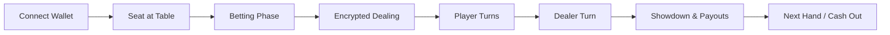

# ♠️ CipherJack – Encrypted Blackjack DApp Suite

CipherJack blends a cinematic blackjack experience with Zama's FHEVM so that every card stays private until it is safe to reveal. This repo now tracks the two halves of the product: a polished React frontend for players and a Hardhat-backed smart-contract workspace for builders.

## ✨ Highlights
- **Wallet-first UX** with multi-player lobbies, rich chip interactions, and responsive layouts.
- **FHE-powered privacy** – encrypted cards are stored on-chain with access controls enforced by Zama coprocessors.
- **Deterministic payouts** handled entirely in Solidity with configurable table stakes and dealer-bank management.
- **Full-stack developer ergonomics** thanks to isolated `frontend/` and `backend/` workspaces, shared documentation, and ready-made scripts.

## 🗂️ Repository Layout
```
blackjack-fhevm/
├── backend/                    # Hardhat project for the Blackjack contract
│   ├── contracts/
│   │   ├── Blackjack.sol       # Core game logic + chip economy
│   │   └── SepoliaConfig.sol   # Shim that wires Zama's config into Hardhat
│   ├── test/
│   │   └── Blackjack.test.js   # Unit tests for chips, banking, and tables
│   ├── hardhat.config.js       # Multi-compiler setup with viaIR enabled
│   └── package.json            # Hardhat + @fhevm/solidity dependencies
├── frontend/                   # Vite + React + Tailwind application
│   ├── src/                    # Pages, hooks, components, and blackjack logic
│   ├── public/                 # Static assets
│   ├── package.json            # Frontend dependencies and scripts
│   └── README.md               # UI-specific instructions (legacy doc)
└── README.md                   # You are here – high level overview
```

## 🔄 Gameplay & System Flow

- **Encrypted state:** every `Card` dealt to a player or dealer is mirrored as `euint8` rank/suit with ACLs that only permit the owner (and relayer) to decrypt.
- **Chip custody:** ETH ↔ chip conversions happen through the contract, enabling free faucets, direct purchases, withdrawals, and a dealer-bank float.
- **Table orchestration:** tables automatically advance from waiting → betting → turns → settlement, emitting events for the frontend lobby to mirror.

## 🧰 Prerequisites
- Node.js 18+
- npm 9+
- Git + a Sepolia wallet for on-chain testing
- (Optional) Bun if you prefer the existing `bun.lockb` inside `frontend/`

## ⚛️ Frontend (UI)
```bash
cd frontend
npm install
npm run dev        # start Vite on http://localhost:5173
npm run build      # production bundle
npm run preview    # preview prod build
npm run lint       # ESLint health check
```
The UI expects the following environment variables (create `frontend/.env`):

| Variable | Description |
| --- | --- |
| `VITE_BLACKJACK_CONTRACT` | Deployed Blackjack contract address |
| `VITE_FHE_TARGET_CHAIN_ID` / `VITE_FHE_GATEWAY_CHAIN_ID` | FHEVM target & gateway chain IDs |
| `VITE_FHE_RELAYER_URL` / `VITE_FHE_RPC_URL` | Relayer + RPC endpoints for encrypted ops |
| `VITE_FHE_ACL_ADDRESS`, `VITE_FHE_KMS_ADDRESS`, `VITE_FHE_INPUT_VERIFIER_ADDRESS`, `VITE_FHE_INPUT_VERIFICATION_ADDRESS`, `VITE_FHE_DECRYPTION_ORACLE_ADDRESS` | Addresses supplied by the Zama coprocessor deployment |
| `VITE_APP_PUBLIC_URL` / `VITE_APP_ICON_URL` | Metadata used by Wagmi connectors |
| `VITE_SEPOLIA_RPC_URL` | Public RPC for wagmi’s chain config |
| `VITE_WALLETCONNECT_PROJECT_ID` | WalletConnect Cloud project identifier |

Refer to `frontend/README.md` for UI-specific copy, gameplay tips, and troubleshooting.

## ⚙️ Backend (Contracts & Tests)
```bash
cd backend
npm install
npm run compile    # hardhat compile
npm run test       # mocha/chai suite via hardhat
```
Key notes:
- `Hardhat` leverages dual compilers (0.8.24 + 0.8.20) plus `viaIR` to keep the Blackjack bytecode buildable despite its large private-state structs.
- `SepoliaConfig.sol` is a lightweight adapter that re-exposes the symbol used by the contract while delegating to `ZamaEthereumConfig`.
- Tests (`test/Blackjack.test.js`) currently cover the chip economy, table lifecycle, and owner bank controls. Extend them as you expand gameplay logic (e.g., betting flows, timeout enforcement, or encrypted reveals).

## 🧪 Quality & Testing Checklist
- `backend`: `npm run test` – deploys to Hardhat Network and executes unit tests.
- `frontend`: `npm run lint` and `npm run build` – ensure TypeScript + Vite output is healthy before deploying.
- Optional: wire anvil or Sepolia endpoints plus the relayer to run full integration sessions with the UI.

## 🚀 Deployment Tips
1. **Contracts:** deploy `backend/contracts/Blackjack.sol` to Sepolia (or your FHE-enabled network) using Hardhat scripts or your preferred tool, then fund the dealer bank via `fundBank`.
2. **Relayer:** update the relayer + ACL/KMS addresses in `.env` so the frontend can request encrypted inputs/decryptions.
3. **Frontend:** run `npm run build` inside `frontend/` and publish the `dist/` folder to Vercel, Cloudflare Pages, Netlify, or a static bucket.

## 🔐 Security & Operational Notes
- Always guard the relayer credentials and only expose read-only RPC keys in `.env` files that ship to clients.
- Bank funds are held in-contract; keep `owner` on a hardware wallet and regularly monitor `bankChips` vs. outstanding wagers.
- Consider adding more Hardhat tests for reentrancy guards, timeout forcing, and bet settlement edge cases as you iterate.

## 🤝 Contributing
1. Fork & clone the repo.
2. Decide whether the change touches `frontend/`, `backend/`, or both.
3. Run the relevant test suites (`npm run lint`, `npm run test`).
4. Open a PR summarizing user-facing impacts and any new env/config requirements.

Have questions? Feel free to open an issue describing the table flow, contract upgrade, or relayer challenge you are investigating.
